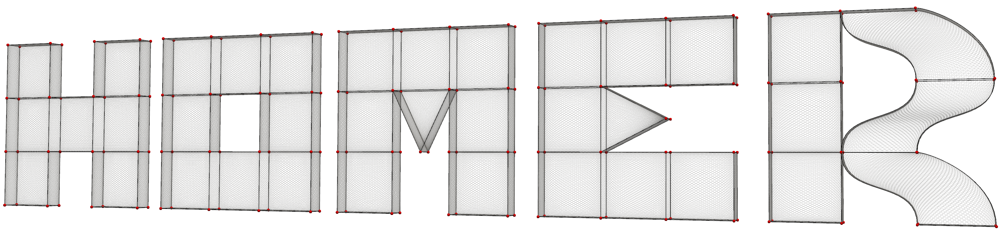

<div align="center">



# HOMER
High Order MEsh Representations.


[](https://opensource.org/licenses/Apache-2.0)


<div align="left">

---
# Overview
HOMER is an open-source, Python-based (v3.8+) library using [JAX)](https://github.com/jax-ml/jax) to define and optimise high order meshes.
It leverages JAX autodifferentiation for efficient fitting and modelling, while keeping the flexibility of python in loss function definitions.
Fix that mesh parameter - constrain a node to lie on a plane =  express another as a combination of PCA components - HOMER handles your derivatives.
**Example application** HOMER helps [MobSTR3D](https://github.com/UOA-Heart-Mechanics-Research/mobstr3D) with flexible geometric and freeform fits for DENSE CMR data 

## Features
- Cubic Hermite, Linear, Square, Cubic and Tetrated Lagrange elements
- Automatic Jacobian sparsity evaluation
- JAX friendly implementations of KDTree evaluations

#### WIP Features
- Faster sparsity estimation!
- meta-fitting examples for statistical shape models!

---

# Installation
It is recommended to use a Conda environment for this project.

```bash
conda create --name HOMER python=3.13
conda activate HOMER
```

Then, either clone:
```bash
git clone https://github.com/abi-breast-biomechanics-group/HOMER
cd HOMER
pip install -e .
```

Or install using PIP directly:
```bash
pip install git+https://github.com/abi-breast-biomechanics-group/HOMER.git
```
