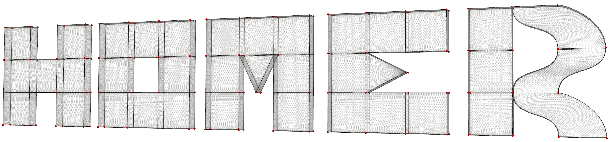

<div align="center">



High Order MEsh Representations.


[](https://opensource.org/licenses/Apache-2.0)


<div align="left">

---
# Overview
HOMER is an open-source, Python-based (v3.8+) library using [JAX](https://github.com/jax-ml/jax) to define and optimise high order meshes.
It leverages JAX autodifferentiation for efficient fitting and modelling, while keeping the flexibility of python in loss function definitions.
Fix that mesh parameter - constrain a node to lie on a plane - express another as a combination of PCA components - HOMER handles your derivatives.

**Example application** HOMER helps [MobSTR3D](https://github.com/UOA-Heart-Mechanics-Research/mobstr3D) with flexible geometric and freeform fits for DENSE CMR data 

## Features
- Cubic Hermite, Linear, Quadratic, Cubic and Quartic Lagrange elements
- Automatic Jacobian sparsity evaluation
- JAX-friendly implementations of KDTree evaluations
- Secondary mesh fields for fibre directions, stresses, and arbitrary vector/scalar data
- Mesh refinement and basis conversion (rebase)
- JSON serialisation/deserialisation
- Green-Lagrange strain evaluation

#### WIP Features
- Faster sparsity estimation!
- meta-fitting examples for statistical shape models!

---

## Supported Basis Functions

| Class | Type | Nodes per direction | Continuity | Derivative fields on node |
|---|---|---|---|---|
| `H3Basis` | Cubic Hermite | 2 | C¹ | `du`, `dv`, … |
| `L1Basis` | Linear Lagrange | 2 | C⁰ | – |
| `L2Basis` | Quadratic Lagrange | 3 | C⁰ | – |
| `L3Basis` | Cubic Lagrange | 4 | C⁰ | – |
| `L4Basis` | Quartic Lagrange | 5 | C⁰ | – |

---

## Quick Example

```python
import numpy as np
from HOMER import Mesh, MeshNode, MeshElement, H3Basis

# 1. Define four corner nodes for a flat 2-D patch
#    (H3Basis requires du, dv, and dudv on every node)
nodes = [
    MeshNode(loc=np.array([0., 0., 0.]), du=np.zeros(3), dv=np.zeros(3), dudv=np.zeros(3)),
    MeshNode(loc=np.array([1., 0., 0.]), du=np.zeros(3), dv=np.zeros(3), dudv=np.zeros(3)),
    MeshNode(loc=np.array([0., 1., 0.]), du=np.zeros(3), dv=np.zeros(3), dudv=np.zeros(3)),
    MeshNode(loc=np.array([1., 1., 0.]), du=np.zeros(3), dv=np.zeros(3), dudv=np.zeros(3)),
]

# 2. Create a bicubic-Hermite element
element = MeshElement(node_indexes=[0, 1, 2, 3],
                      basis_functions=(H3Basis, H3Basis))

# 3. Build and visualise the mesh
mesh = Mesh(nodes=nodes, elements=element)
mesh.plot()

# 4. Evaluate points on the surface
xis = mesh.xi_grid(res=10)                               # (100, 2) parametric grid
pts = mesh.evaluate_embeddings_in_every_element(xis)     # (100, 3) world-space points

# 5. Save and reload
mesh.save('my_mesh.json')
from HOMER.io import load_mesh
mesh2 = load_mesh('my_mesh.json')
```

---

# Installation
It is recommended to use a Conda environment for this project.

```bash
conda create --name HOMER python=3.13
conda activate HOMER
```

Then, either clone:
```bash
git clone https://github.com/abi-breast-biomechanics-group/HOMER
cd HOMER
pip install -e .
```

Or install using PIP directly:
```bash
pip install git+https://github.com/abi-breast-biomechanics-group/HOMER.git
```

To install documentation build dependencies:
```bash
pip install "HOMER[docs]"
mkdocs build
mkdocs serve   # live preview at http://127.0.0.1:8000
```

