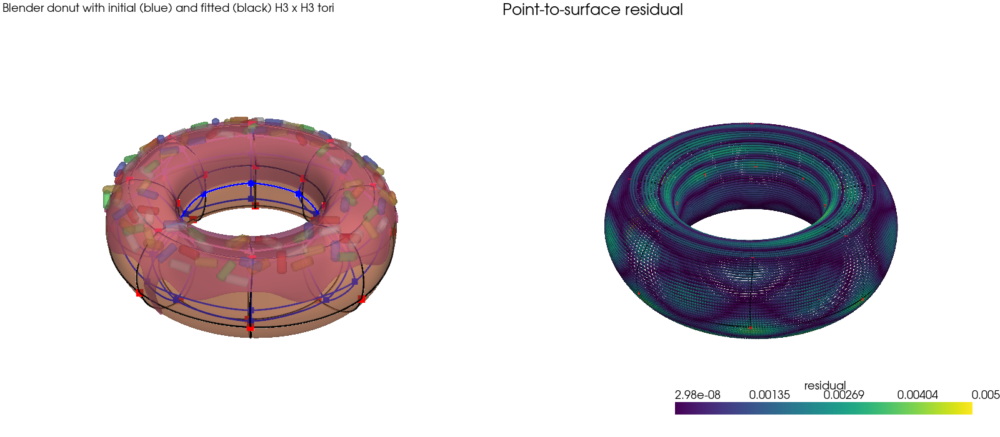

# H3 donut: fitting a closed cubic Hermite surface with HOMER

Fits a bicubic Hermite (`H3Basis` x `H3Basis`) torus mesh to the body of a
Blender donut, following the point-to-surface fitting pattern used by
MeshVOS for the breast skin surface.



## Source model

`DONA.blend` is the unmodified
[Homer donut](https://sketchfab.com/3d-models/homer-donut-9f3ebb06393245f0a273e6e9baadd2a5)
by micho6307 on Sketchfab, licensed CC BY 4.0.

The file contains three kinds of objects. Only the torus body (`Rosca`) is
fitted; the icing shell (`Rosca.001`) and the 100 sprinkle cylinders are
ignored.

## Files

| File | Role |
|------|------|
| `DONA.blend` | Original Blender model |
| `export_donut_points.py` | Runs inside Blender: writes `donut_points.ply` (the body `Rosca` with its subdivision modifier applied, 36,864 vertices with faces and normals) and `donut_scene.ply` (body, icing and sprinkles with modifiers applied and per-vertex RGB from each material's base colour) |
| `donut_points.ply` | Fitting target, kept in the repo so the fit runs without Blender |
| `donut_scene.ply` | Coloured whole-donut surface for visualisation, kept for the same reason |
| `fit_donut.py` | Builds the initial torus, fits it, reports residuals, saves both meshes and the figure |
| `h3_donut_initial.json` | Initial H3 x H3 torus before fitting |
| `h3_donut.json` | Fitted HOMER mesh (32 H3 x H3 elements, 32 nodes) |
| `h3_donut_fit.png` | Final visualisation: coloured Blender donut with the initial torus (blue) and fitted torus (black lines, red nodes), and the residual map |

## Running

```bash
python fit_donut.py           # fit, save h3_donut.json and h3_donut_fit.png
python fit_donut.py --show    # also open the interactive PyVista scene
```

Requires HOMER (`pip install -e .` from the repo root). Blender 4.x is only
needed to regenerate the PLY files; `fit_donut.py` calls it automatically
when either is missing (`--blender` overrides the executable path).

## Method

1. Estimate the torus centre, major radius and elliptical tube half-axes
   from the point cloud.
2. Build a periodic bilinear grid of 8 x 4 elements whose nodes wrap in
   both parametric directions, so the mesh is closed with no boundary nodes.
3. `rebase([H3Basis, H3Basis])` converts the grid to cubic Hermite and
   initialises the `du`, `dv`, `dudv` fields from the geometry.
4. Least-squares fit of all 384 nodal parameters. Each residual block is the
   vector from a data point to its embedded location on the mesh surface
   (`embed_points(surface_embed=True)`), plus a Sobolev smoothness term
   weighted by 0.1 relative to the initial mesh. The sparse Jacobian comes
   from `HOMER.jacobian_evaluator.jacobian`.

## Result

Residuals on all 36,864 surface points, in model units (the donut is about
2.5 units across):

| | mean | p95 | max |
|---|---|---|---|
| Initial torus | 0.085 | 0.153 | 0.167 |
| Fitted H3 mesh | 0.0012 | 0.0030 | 0.0054 |
